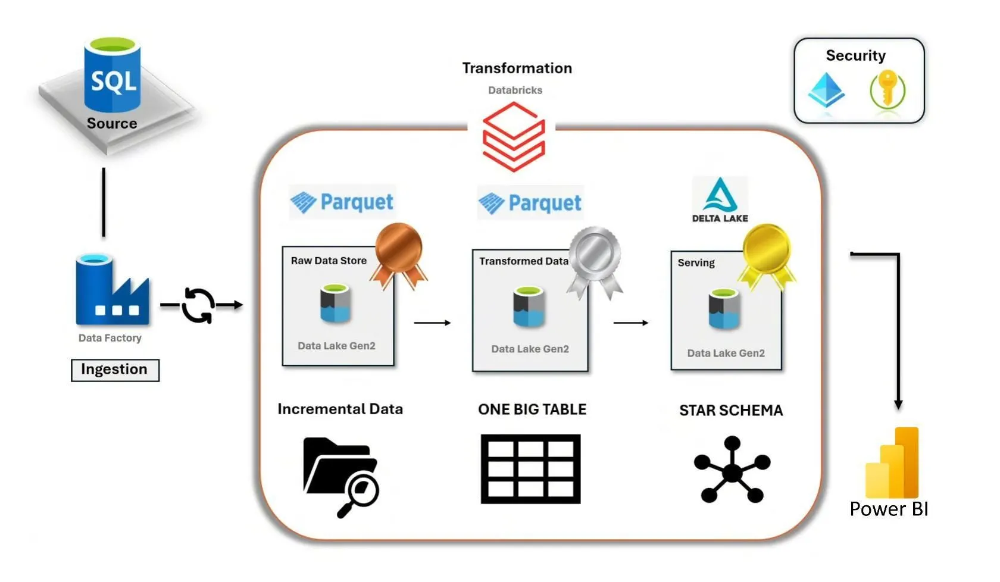
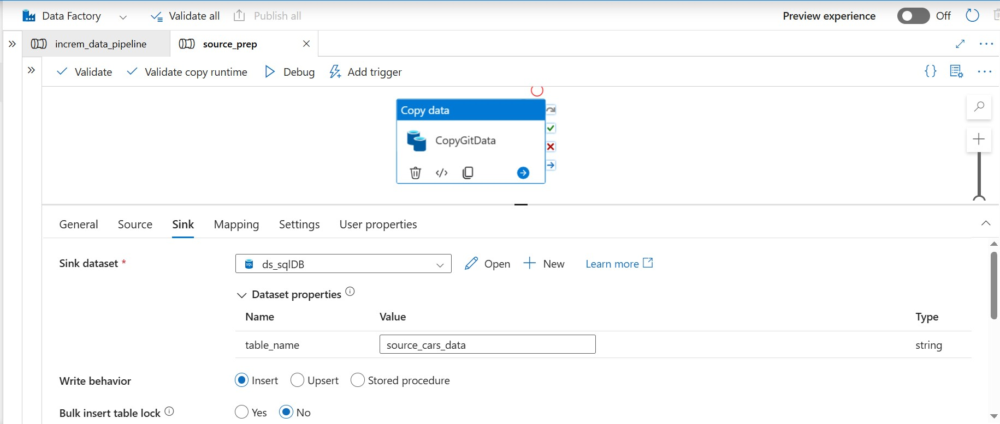
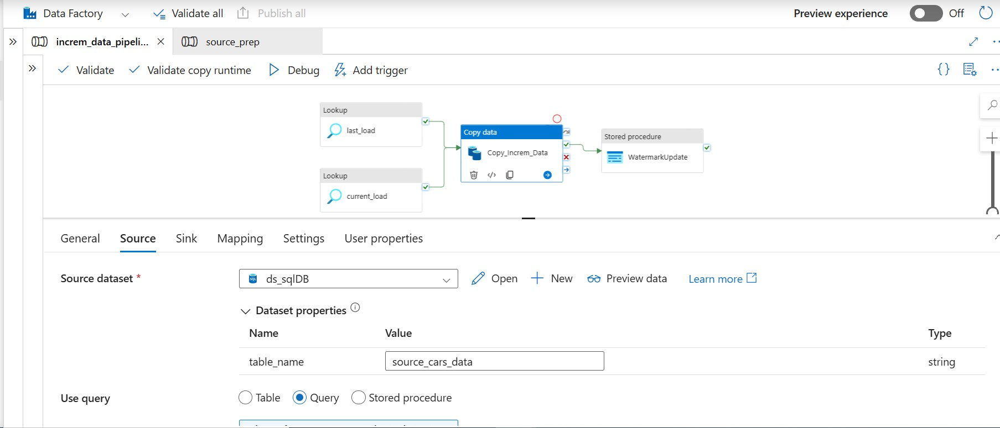
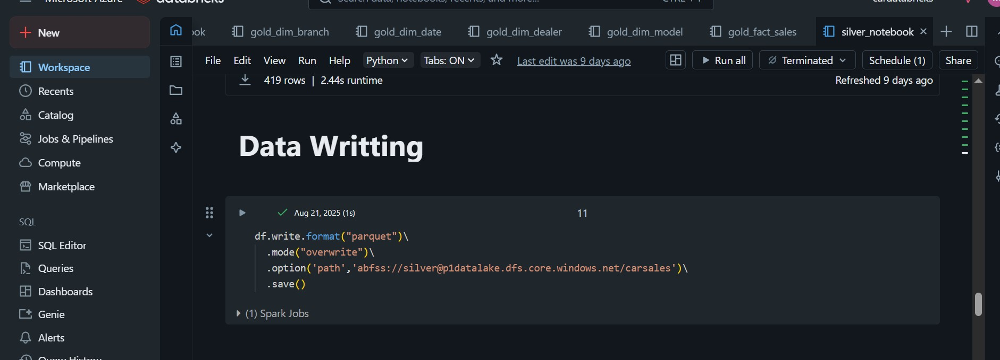
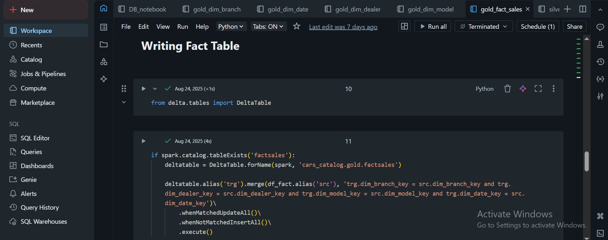
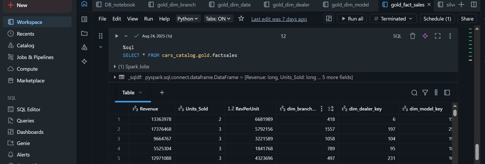
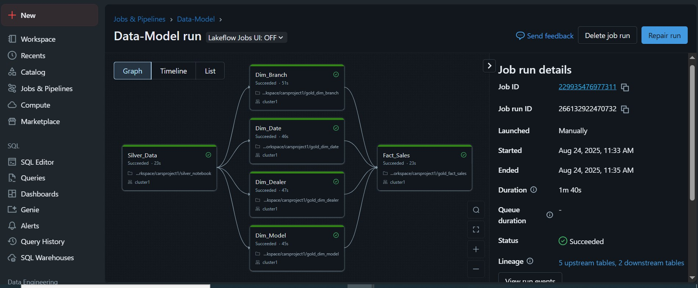
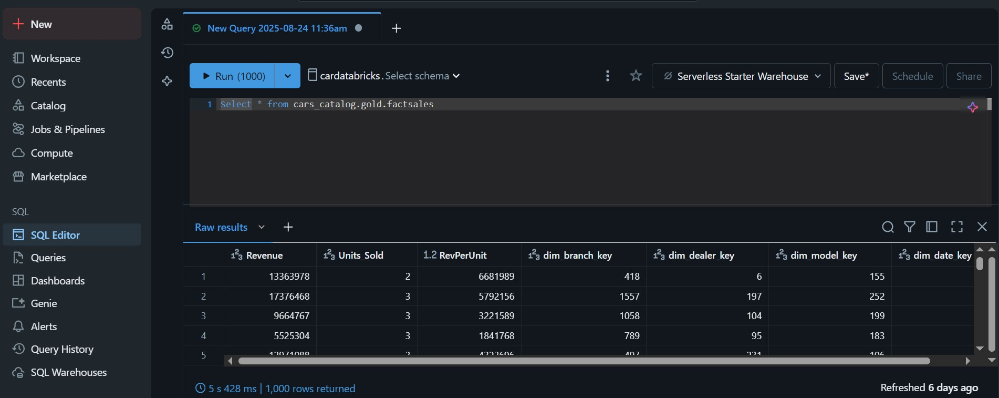

# 🚀 Azure End-to-End Data Engineering Project – Medallion Architecture

This repository demonstrates an end-to-end **data engineering pipeline** using Azure services, following the **Medallion Architecture** (Bronze → Silver → Gold).

---
<h2 align="center">🏗️ Architecture</h2>

  

 <!-- ## Architecture
 -->

**Flow:**
1. Data ingestion with **Azure Data Factory** into **ADLS Gen2** (Bronze).
2. Transformation & cleaning with **Databricks (PySpark)** (Silver).
3. Dimensional modeling & fact table creation with Delta Lake (Gold).
4. Loading into **Azure SQL Database** for reporting.
5. Optional **Power BI** visualization.

---

## ⚙️ Services & Tools
- Azure Data Factory (ADF)
- Azure Data Lake Storage Gen2
- Azure Databricks (PySpark, Delta Lake)
- Azure SQL Database
- Power BI (optional)

<h2 align="center">🏗️Architechture with Flow</h2>

  

## 📂 Repository Contents
- **/notebooks**: PySpark scripts for Bronze, Silver, and Gold layers.
- **/adf**: Sanitized JSON exports of pipelines & datasets.
- **/sql**: SQL scripts for creating tables & validation queries.
- **/screenshots**: Screenshots of pipeline runs, jobs, SQL outputs.
- **/architecture**: Architecture diagram.

---
<!--
## 📝 Key Steps
1. **Bronze Layer (Raw Ingestion)**  
   - Ingest CSV/JSON from source into ADLS using parameterized ADF pipeline.  

2. **Silver Layer (Transformations)**  
   - Clean nulls, cast datatypes, normalize schema using PySpark in Databricks.  

3. **Gold Layer (Business-Ready Data)**  
   - Build dimension tables (SCD Type 1 logic using Delta merge).  
   - Build fact table with joins across dimensions.  

4. **Load into SQL DB**  
   - Curated Gold layer is loaded into Azure SQL Database.  

--- -->

## ⚙️ Project Workflow (Detailed Steps)  

The project follows the **Medallion Architecture** consisting of three main layers: **Bronze**, **Silver**, and **Gold**.  

---

### 🥉 Step 1: Bronze Layer – Raw Data Ingestion with Azure Data Factory

- Data is ingested from external sources (CSV files, JSON logs, etc.).  
- The raw data is stored as-is in **Azure Data Lake Storage (ADLS)** under the **Raw Zone**.  
- Purpose: Maintain an immutable copy of the source data for auditing and replay.  

<h3 align="center">Source Pipieline</h3>

  

  

<h3 align="center">Incremental Pipelinee</h3>

  

  

### 🥈 Step 2: Silver Layer – Data Cleaning & Transformation  

- Raw data is processed using **Azure Databricks (PySpark)**.  
- Transformations include:  
  - Handling missing values  
  - Standardizing schema  
  - Filtering invalid records  
  - Enforcing data quality checks  
- The cleaned & normalized data is stored in ADLS **Curated Zone**.  
- Refer to [Silver](notebooks/silver_notebook.py) Notebook provided in the Notebooks folder. 

<h3 align="center">Post Transformations Data Written to Silver Layer in ADLS</h3>

  

  

---

### 🥇 Step 3: Gold Layer – Business Aggregation  

- Business-ready data is prepared by applying:  
  - Aggregations (sums, averages, counts)  
  - Joins across multiple curated datasets  
  - Data model transformations for reporting  
- Final tables are stored in **Azure SQL Database** (serving layer).  
- This data is then available for **Power BI dashboards** or other BI tools.  
- Refer to [Gold fact sales](notebooks/gold_fact_sales.py) Notebook provided in the Notebooks folder.

<h3 align="center">Data Writting to Gold Layer</h3>

  

  

<h3 align="center">Data in Gold Layer</h3>

  

  

### 🔄 Step 4: Orchestration (ADF) & Compute (Databricks)

- **Azure Data Factory (ADF)** is used **For orchestration and ingestion of Incremental Pipeline**:
  - Triggers/schedules pipelines.
  - Copies **raw data → ADLS (Bronze)**.
- **All compute happens in Databricks**:
  - **Bronze → Silver**: cleansing, standardization, and quality checks in **Databricks (PySpark)**.
  - **Silver → Gold**: business logic, joins, aggregations, and SCD logic **on Databricks compute (clusters/Jobs)**.
- After creating the Fact tables and the dimensions in the Gold layer, the Data Analyst can now use this data to make SQL queries via the SQL Editor
- Databricks writes **Silver** and **Gold** datasets back to ADLS (Delta).  
  *(Optional) Final serving to Azure SQL/BI can be triggered by ADF or written directly from Databricks, depending on your setup.*

<h3 align="center">Data Model Pipeline in Databricks</h3>

  

<h3 align="center">Gold Schema Ready for Data Analysis</h3>

  

<!--

## 📊 Screenshots
- ADF Pipeline: 
- Databricks Notebook: 
- SQL Table Output: 

--->
<!--
## 🔑 Learnings
- Parameterized pipelines in ADF for incremental loading of data  
- PySpark transformations with Databricks  
- Medallion architecture implementation (Bronze → Silver → Gold)  
- SCD Type 1 logic with Delta Lake  
- SQL DB integration for downstream analytics  -->

## 📚 Key Learnings from the Project  

Working on this end-to-end Azure Data Engineering project gave me hands-on exposure to real-world challenges and cloud-native solutions.  

### 🔹 1. Azure Data Factory (ADF) – Orchestration & Ingestion  
- Learned how to design and schedule **ETL pipelines**.  
- Hands-on with **Linked Services, Datasets, Triggers, and Pipelines**.  
- Understood how to **ingest raw data** from both **API sources** and **local/Blob storage** into **Azure Data Lake Storage (ADLS)**.  
- Learned monitoring & debugging of pipeline runs.  

### 🔹 2. Azure Data Lake Storage (ADLS) – Layered Storage  
- Designed a **layered data lake structure (Bronze, Silver, Gold)**.  
- Understood why raw data must be immutable (**Bronze**) and how clean data is structured (**Silver → Gold**).  
- Worked with **Delta format** for efficient data storage, versioning, and ACID compliance.  

### 🔹 3. Databricks & PySpark – Data Transformation & Compute  
- Gained practical skills in **PySpark** for large-scale data processing.  
- Learned to handle **null values, duplicates, schema evolution, and data validation checks**.  
- Implemented **business transformations and aggregations** to build **Gold tables**.  
- Learned how **Databricks clusters** are used for scalable compute.  

### 🔹 4. Medallion Architecture – Best Practices in Data Engineering  
- Applied the **Bronze → Silver → Gold** approach for structured data pipelines.  
- Understood the importance of **separation of concerns** between raw, cleaned, and curated datasets.  
- Gained exposure to designing a **modular and reusable data pipeline** that is production-ready.  

### 🔹 5. Integration with Analytics & BI  
- Prepared **Gold datasets** optimized for consumption by BI tools (like Power BI / Azure SQL).  
- Learned how curated data can power **dashboards and reports** for decision-making.  

### 🔹 6. Real-World Skills Developed  
- Debugging common errors (e.g., invalid SQL object names, schema mismatches).  
- Designing pipelines that are **scalable, maintainable, and automated**.  
- Writing **clean PySpark code** for data wrangling.  
- Understanding the **end-to-end flow of data in Azure ecosystem**.  

---

📌 **In summary**: This project helped me strengthen my **cloud data engineering skills** by building an end-to-end pipeline with **ADF, ADLS, Databricks (PySpark), and the Medallion architecture** — exactly how modern data platforms are designed in industry.  

## 👤 Author
Project implemented by **Akhilesh Kadam** 
